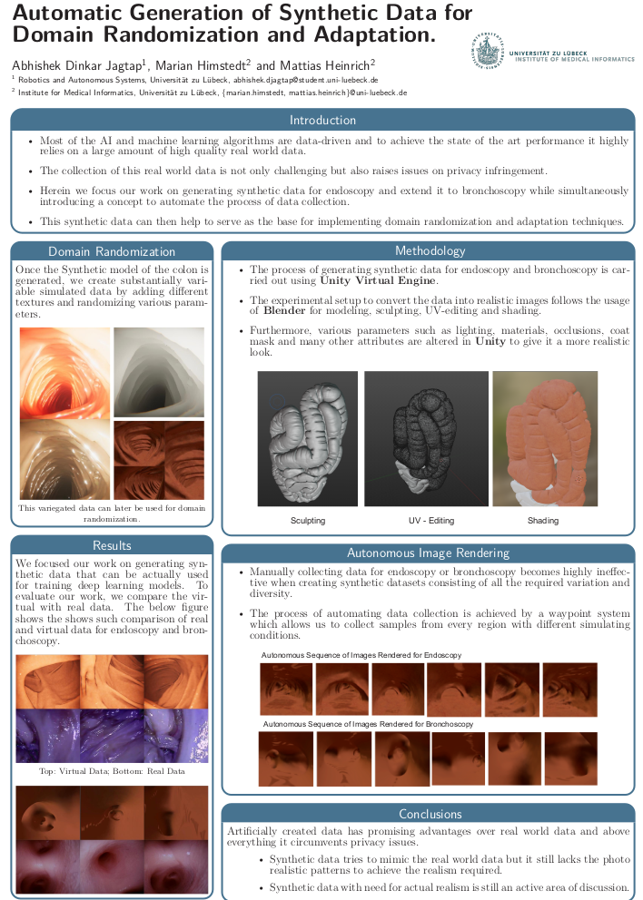

# Automatic Generation of Synthetic Colonoscopy Videos for Domain Randomization

By Abhishek Jagtap, Marian Himstedt

This repository contains the method and pipeline proposed for generating domain randomized synthetic data as described in [Automatic Generation of Synthetic Colonoscopy Videos for Domain Randomization](https://www.degruyter.com/document/doi/10.1515/cdbme-2022-0031/html?lang=de). Our Paper was accepted and nominated for the best research paper award for [computer and robot-assisted surgery at the 21st annual conference of CURAC (2022)](https://www.curac.org/de/curac-2023/vergangene-jahrestagungen)

The Poster for the Paper summarizing the content can be found here:





## Table of Content

-Item 1 #Prerequisites
-Item 2 #Installation
-Item 3 #Getting Started
-Item 4 #Usage
-Item 5 #Citation

## Pre-requisites

- Unity Hub [Install 2021](https://unity.com/download)
- ML-Agents [Toolkit](https://github.com/Unity-Technologies/ml-agents)
- Blender [For 3D Modelling](https://www.blender.org/)
- Colon Mesh [Will share the link](https://www.blender.org/)

## Installation
#Clone the repository
After Installing the required tools, you can clone the repository 
`git clone https://github.com/abhishekjagtap1/Automatic-Generation-of-Synthetic-Colonoscopy-Videos-for-Domain-Randomization.git `

Use the master file as existing project and open unity hub, 

## Getting Started

# 3D Model Preparation

To generate colonoscopy images from scratch, we need to create the 3D model using blender

-Item 1 Use the colon mesh as starting point and import it into blender for rendering realistic textures and shades.
-Item 2 The whole process of generating 3D colon is borrowed from [VR-Caps](https://github.com/CapsuleEndoscope/VirtualCapsuleEndoscopy/tree/master/Creating%203D%20Models%20Tutorial)
-Item 3 Follow the tutorial to obtain a 3D model of the Colon and make sure to export the .blend file 

## Photorealistic Rendering

Firstly open the Record_scene.unity from Assets/Scenes directory, This will be the default scene for recording image sequences or video. The attached scripts pertaining to camera, capsule and colon are periodically arranged and set to default.
Use the Unity High definition Render Pipeline with controlled parameters for lighting occlusion and surface texture, Refer to the paper for precise tabular info

## Automated Video Rendering

Once the 

Will complete it later.......

## Citation

### Reference
Few Sections are adapted from [VR-Caps](https://github.com/CapsuleEndoscope/VirtualCapsuleEndoscopy/tree/master/Creating%203D%20Models%20Tutorial)

If you find this work helpful kindly cite:

```bibtex
@article{dinkar2022automatic,
  title={Automatic Generation of Synthetic Colonoscopy Videos for Domain Randomization},
  author={Dinkar Jagtap, Abhishek and Heinrich, Mattias and Himstedt, Marian},
  journal={Current Directions in Biomedical Engineering},
  volume={8},
  number={1},
  pages={121--124},
  year={2022},
  publisher={De Gruyter}
}
```


